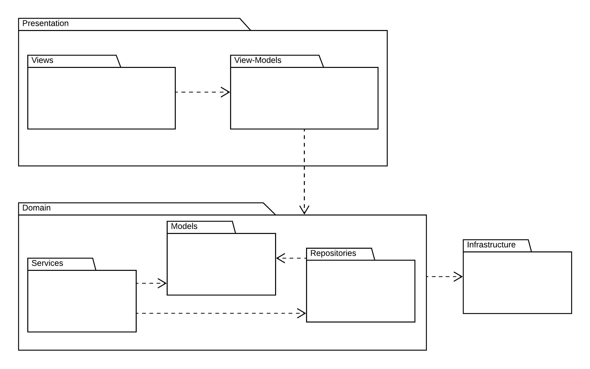
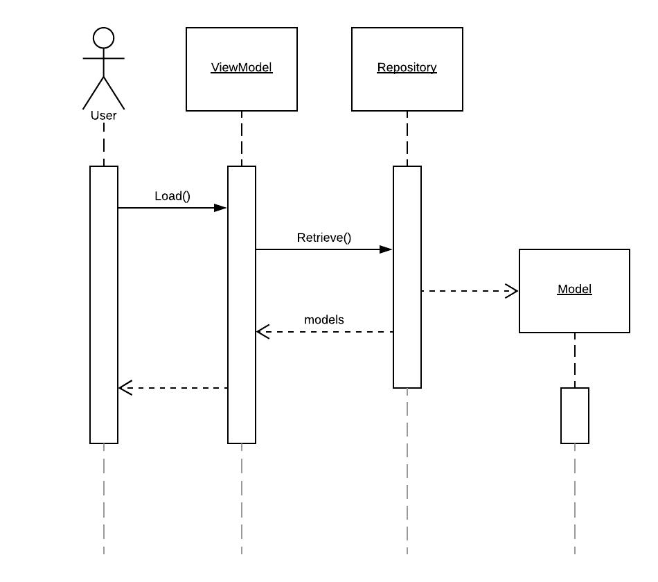
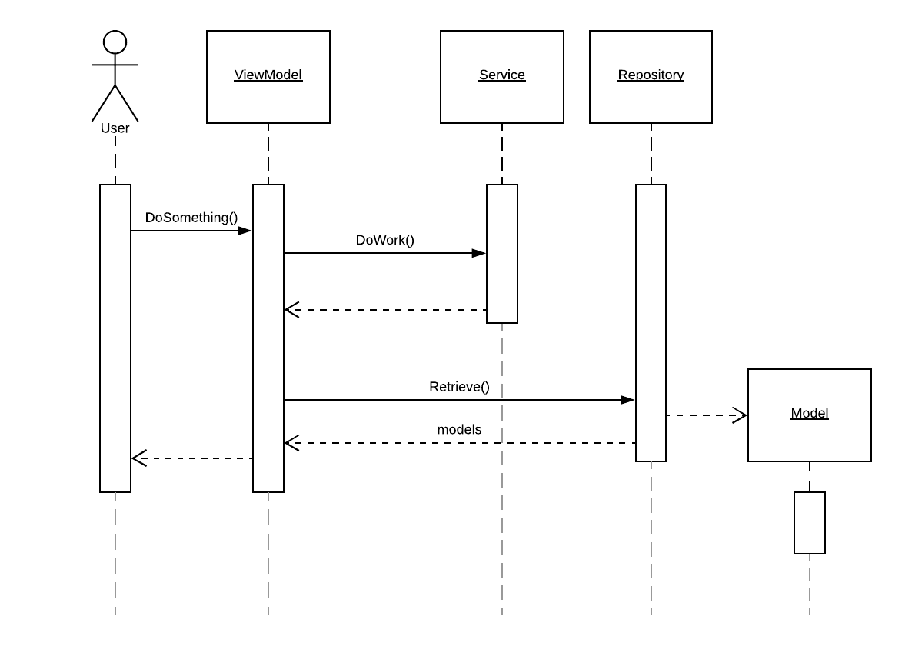
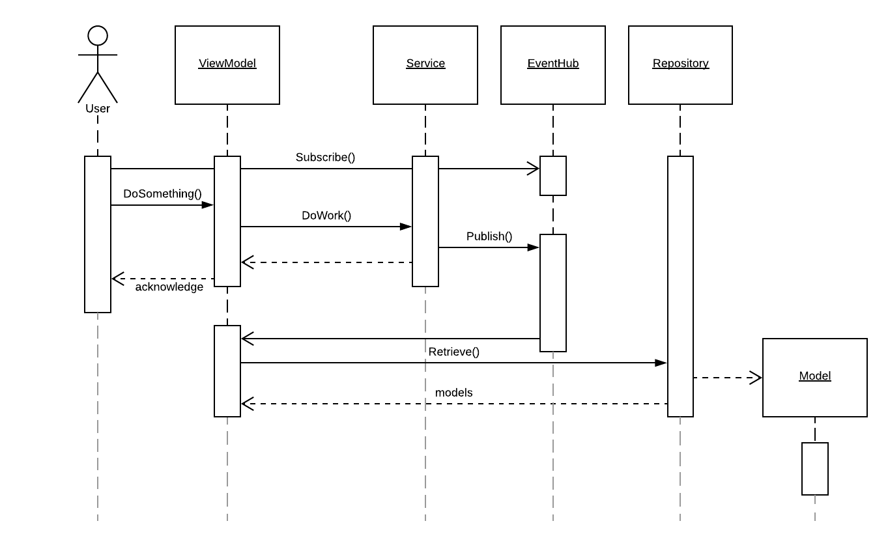
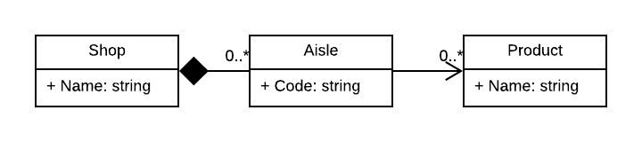

# DAA::StateManagement

## Refresh buttons are lazy
Modern business applications should be their user's allies in tackling the complexity of day to day activities. To achieve that, they must not add overhead to already difficult processes. Asking the user to take actions in order to maintain the integrity of the presented data is unnecessary. **The most up to date data should be made available without further interaction, always.**

## State management is hard
Making sure your application always present the most up to date data is difficult. More precisely, it's difficult to scale. One can reason about many approaches to satisfy the requirement, but in practice, the implementation can result in duplication or weak and awkward design elements that are difficult to maintain.

### The traditional approach
In a traditional application, where state management is not a big concern, things are quite straight forward. Let's assume the following structure of a traditional layered application that employs the M.V.VM. pattern and data binding in the presentation layer. 

 

In this scenario, a Command triggered in the View-Model will result in Models being acquired from a Repository. The Models are then stored in the View-Model's state and data is made available to the View through data binding. 

This works very well when state changes are the result of user issued Commands within the scope of a single instance. When the user initiates a process that is being executed by a Service and results in changes in the application's persistence, the View-Model retrieves the fresh data from the Repository once the process ends. 

### The reactive approach
The traditional approach becomes challenging when the same data is presented in multiple Views and even more challenging when data is modified outside of the application's instance. 

To tackle this, developers may choose to employ reactive programming techniques to maintain the application's state. In doing so, View-Models no longer refresh their copy of the data at the end of a given process, instead they subscribe to Events that are published whenever data is mutated.

### Increasing complexity
The reactive approach works very well when building applications that satisfy the following conditions:
1. Data is changed by a small number of Commands
2. Data is presented in a limited number of Views 
3. Data composition is relatively flat.

When a type of data is changed by numerous Commands, the View-Models that are interested in said data need to be aware of, and react to, a large set of Events. As the number of interested View-Models increases, it becomes more and more difficult to ensure that the state is correctly maintained throughout the application. This also, inevitably, leads to increasing duplication and the approach starts affecting the application's maintainability.

When a type of data is composed of numerous other types, the complexity increases as interested View-Models need to handle an increasing number of Events. To illustrate the problem, let's take the extreme example of a View that presents the products found in shops near you, grouped by aisle. 

 

In this scenario, all interested View-Models need to be aware that:
1. A shop may change its name
2. A shop may add, remove or re-code its aisles
3. Products are placed on and removed from aisles
4. The same product may be placed on multiple aisles
5. A product's name could change, and when it does, the change likely applies to all the shops.

The burden of state management has become too much for the View-Models to handle. At this point, **improperly designed state management is slowing down development**.
